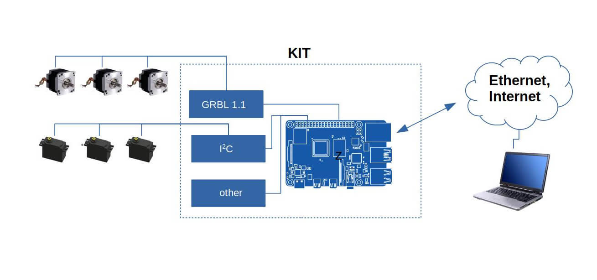

Довольно часто бывает необходимо взаимодействовать с оборудованием по протоколу который с одной стороны был бы функциональным, а с другой был достаточно простым в изучении. По сути таковым является HTTP сериализованный в (JSON, XML, ...). Но реалии таковы, что зачастую для взаимодействия с оборудованием приходится использовать специальные промышленные, иногда проприеритарные, узко заточенные протоколы.

Рынок программ для управления стремительно растет. Сейчас можно найти огромное количество продуктов которые помогают автоматизировать большинство процессов в бизнесе. И даже если среди этих программ не окажется той которая бы идеально вам подошла, огромное число компаний готово написать вам уникальное решение за вменяемые сроки и стоимость.
Но очень редко бывает так, что компания готовая взяться за ваш проект и которая подходит вам, имеет у себя в штате специалиста по работе со специфическим, промышленным протоколом.

С другой стороны бываю ситуации когда вам необходимо разработать новое оборудование для взаимодействия с которым так же необходимо предусмотреть простой и популярный протокол.

В таких ситуациях как нельзя лучше подойдет наш продукт (KIT).

### О продукте
Разработанный специалистами нашими программный продукт не заточен по конкретную архитектуру или операционную систему,  поэтому может использоваться на любом подходящем для вас оборудовании.

Вот не полный список устройств на которых может быть основан наш (KIT):
- Raspberry pi
- Onion omega
- Asus Tinker Board
- Odroid
- Banana Pi

а так же любые другие платы на которых есть возможность установить операционную систему от Microsoft или Linux.

Объединяя в себе, с одной стороны возможность управлять интерфейсами на плате (I2C, GRBL, PWM, …), а с другой интерфейсы сети (WiFi, Ethernet) наш продукт выступает в роли прокси и предлагает мощнейший функционал и гибкость. Вашим специалистам, всего лишь, нужно будет уметь работать с одним протоколом основанном на HTTP, чтобы управлять или мониторить оборудование.

---

### Области применения
Возможности нашего набора таковы, что его можно с легкостью применять в таких областях как:
- Автоматизация оборудования на производстве
- Вендинговые автоматы
- Автоматизация аптек
- Роботизация складских помещений
- Строительная 3D печать
- Автоматизация в рекламе