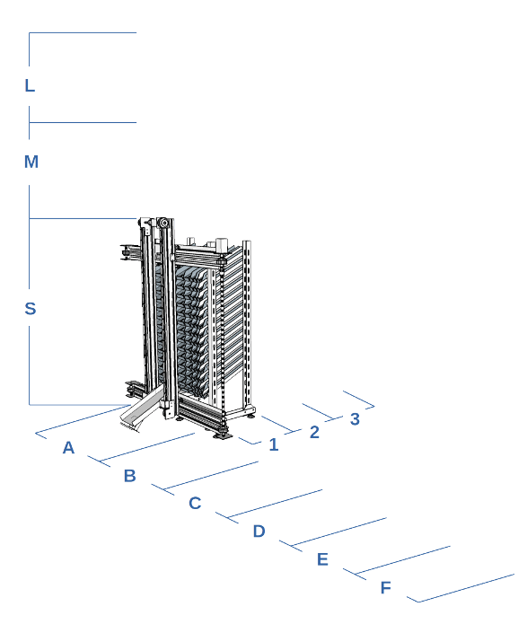

Благодаря совместной работе со специалистами компании [«Voltaro»](https://voltaro.com.ua) нами была разработана автоматизированная система хранения и подачи медикаментов с открытым [API](/docs "Документация по API"). Данный программно аппаратный комплекс работает на основе нашего [контроллера](/projects/controller "Универсальный контроллер") и может быть легко модифицирован в зависимости от пожеланий.

## Принцип работы
Контроллер поддерживает работу по безопасному протоколу HTTPS с поддержкой авторизации по токену JWT. В начале работы необходимо авторизоваться и получить JWT токен для доступа к системе управления роботом.

После получения токена можно приступать к управлению роботом, передавая в параметрах запроса номер ячейки и количество которое необходимо извлечь.

Для удобства можно использовать встроенную базу данных в которой содержится информация о том в какой ячейке и в каком количестве находится тот или иной товар.

## Конфигурация
Модельный ряд, робота, разрабатывался с учетом различных потребностей, что дает возможность заказчику легко сконфигурировать заказ под необходимые размеры или бюджет. Основными параметрами для конфигурации модели выступают: 

высота (в метрах)
- **S** - 1,0
- **M** - 1,5
- **L** - 2,0

глубина (в метрах)
 - **1** - 0,275
 - **2** - 0,550
 - **3** - 0,825

ширина (в метрах)
- **A** - 0,5
- **B** - 1,0
- **C** - 1,5
- **D** - 2,0
- **E** - 2,5
- **F** - 3,0

---

Расшифровка модельного номера:

**RP-L3C**

где:
- **R** - Robot
- **P** - Pharmacist
- **L** — (высота)
- **3** — (глубина)
- **C** — (ширина)

> Размеры относятся только к габаритам робота и не учитывают габариты защитного корпуса.

## Преимущества
- открытый (API) с поддержкой JWT
- защищенный протокол https
- встроенная база данных медикаментов
- конкурентная цена
- быстрое конфигурирование и подключение
- широкий выбор модификаций
- возможность изменения типов полок после ввода в эксплуатацию без демонтажа.